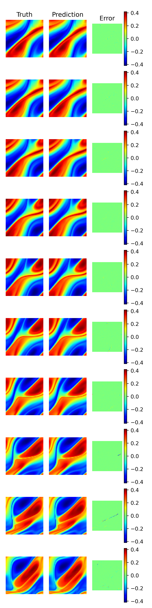
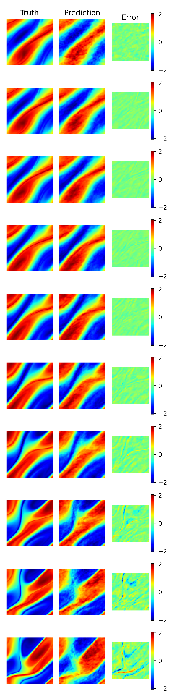
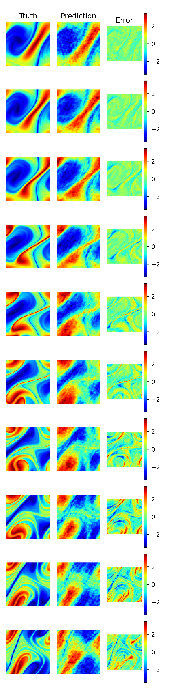

This is an overview of some benchmark results to compare the performance
of different operator architectures on various problems.

The benchmarks are implemented in the `benchmarks` directory and we refer to
this directory for detailed information on how the benchmarks are run.

## [NavierStokes](../api/continuiti/benchmarks/#continuiti.benchmarks.NavierStokes)

Reference: _Li, Zongyi, et al. "Fourier neural operator for parametric partial
differential equations." arXiv preprint [arXiv:2010.08895](https://arxiv.org/abs/2010.08895) (2020)_
_Table 1_ ($\nu$ = 1e−5  T=20  N=1000)

_reported for_ FNO-3D: __0.1893__ (rel. test error)

[FourierNeuralOperator](../api/continuiti/operators/#continuiti.operators.FourierNeuralOperator)

| Depth | Parameters | Training Time (V100) | rel. train error | rel. test error |
|-------|------------|----------------------|------------------|-----------------|
|     4 |       201M |                91min |         4.94e-03 |      __0.1862__ |
|    16 |       805M |               181min |         1.84e-04 |          0.1486 |

Visualization of best and worst training and test samples for FNO with depth 4 (as in paper).
<table>
<tr>
<td>
Best training sample 

rel. error = 2.3351e-03
</td>
<td>
Worst training sample 

rel. error = 1.0090e-02
</td>
<td>
Best test sample 

rel. error = 1.0219e-01
</td>
<td>
Worst test sample 

rel. error = 4.4294e-01
</td>
</tr>
</table>


